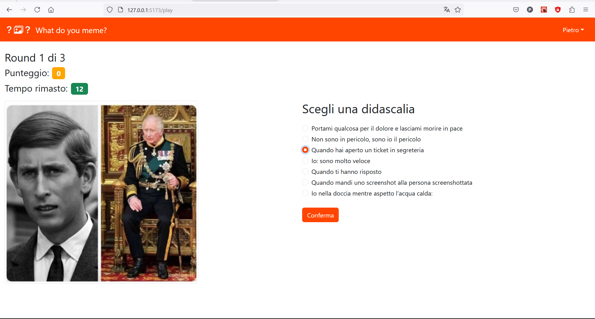
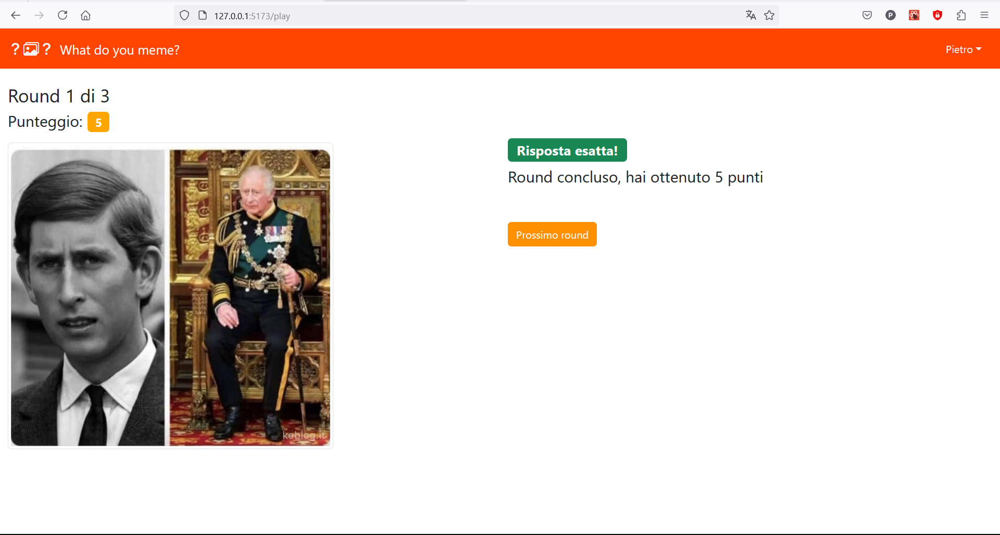

# Exam #1: "What do you meme?"
## Student: s301332 NOTO PIETRO 

## React Client Application Routes

- Route `/`: pagina principale dell'applicazione. Carica sempre il componente NavHeader e un Outlet che mostra il contenuto delle route figlie, in seguito elencate;
- Route `/login`: schermata di login;
- Route `/play`: schermata di gioco. Copre tutte le fasi della partita; carica i componenti Game, GameComponent, RoundComponent, FormComponent, TimerComponent, RoundResultComponent e GameSummaryComponent;
- Route `/user-history`: schermata che mostra le informazioni di profilo dell'utente (nome ed email) e un elenco di tutte le partite giocate; carica il componente History;
- Route `*`: schermata che comunica all'utente che la pagina richiesta non esiste. Carica il componente NotFound.

## API Server

- GET `/api/pics/rand/:n`: trova n (1 per gli utenti non loggati, 3 per quelli loggati) immagini prese randomicamente
    - `:n`: numero di immagini richieste randomicamente;
    - `[<picId1>]` oppure `[<picId1>, <pidId2>, <picId3>]`;
- GET `/api/captions/exclude/:pic_id`: trova 5 didascalie random escludendo quelle che non si abbinano all'immagine `pic_id`
    -  `:pic_id`: id dell'immagine;
    -  `[<caption1>, <caption2>, <caption3>, <caption4>, <caption5>]`;
- GET `/api/pics/:pic_id/rand/captions`: trova randomicamente 2 tra le didascalie che si abbinano all'immagine `:pic_id`
    -  `:pic_id`: id dell'immagine;
    -  `[<caption1>, <caption2>]`;
- GET `/api/pics/:pic_id/captions`: trova tutte le didascalie che abbinano all'immagine `:pic_id`
    - `:pic_id`: id dell'immagine;
    - `[<caption1>, <caption2>, ..., <captionN>]`;
- GET `/api/users/:u_id/games`: trova tutte le partite giocate dall'utente loggato `:u_id`
    - `:u_id`: id associato all'utente nel database;
    - `[{"u_id": 1, "score": 5, "timestamp": "2024-06-24T12:11:14+02:00", "pic_ids": "4g,11n,6n"}, {...}, ... ]`;
- GET `/api/sessions/current`: recupera la sessione di login corrente
    - `none`;
    - `{"id": 1, "username": "pietro.noto@polito.it", "name": "Pietro"}`;
- POST `/api/users/:u_id/games`: salva la partita appena giocata da un utente loggato
    - `{"u_id": 1, "score": 5, "timestamp": "2025-05-09T15:38:28+02:00", "pic_ids": "5,6,7"}`;
    - `none`;
- POST `/api/sessions`: salva una sessione di login per autenticare un utente
    - `{"username": "pietro.noto@polito.it", "password": "pietro"}`;
    - `none`
- DELETE `/api/sessions/current`: consente di fare logout cancellando la sessione di login corrente
    - `none`;
    - `none`;

## Database Tables

- Table `USERS` - `(u_id, email, name, hash, salt)`, `u_id` chiave primaria;
- Table `CAPTIONS` - `(cap_id, caption)`, `cap_id` chiave primaria;
- Table `MEMES` - `(pic_id, cap_id)`, `(pic_id, cap_id)` chiave primaria;
- Table `GAMES` - `(u_id, score, timestamp, pic_ids)`, `(u_id, timestamp)` chiave primaria 

## Main React Components

- `App` (in `App.jsx`): si occupa di recuperare la sessione di login, se presente, e di gestire le operazioni di login e logout, nonché di navigare tra le varie route;
- `NavHeader` (in `NavHeader.jsx`): barra superiore che mostra il nome dell'applicazione e consente all'utente di autenticarsi, se non l'ha fatto, o di visualizzare il componente UserDropdown, descritto in seguito;
- `UserDropdown` (in `NavHeader.jsx`): tendina che consente ad un utente autenticato di visualizzare le proprie informazioni e la cronologia delle partite giocate, oppure di effettuare il logout;
- `Home` (in `HomeLayout.jsx`): mostra la schermata principale, che illustra brevemente lo scopo del gioco, e permette di effettuare il login e/o di iniziare una partita;
- `LoginForm` (in `LoginLayout.jsx`): visualizza un form per effettuare il login. L'utente deve inserire i propri username (almeno 5 caratteri) e password (almeno 4 caratteri). Se il login ha successo, rimanda alla home;
- `Game` (in `GameLayout.jsx`): wrapper che recupera dal server un'immagine per ogni round (1: utenti anonimi, 3: utenti loggati); per ciascuna di esse ottiene dal server due didascalie corrette e cinque sbagliate;
- `GameComponent` (in `GameLayout.jsx`): si occupa di salvare le didascalie confermate e il numero del round corrente. Se sono rimasti ancora round, carica RoundComponent, altrimenti GameSummaryComponent;
- `RoundComponent` (in `RoundLayout.jsx`): mostra l'immagine associata al round corrente, il punteggio totale, il tempo rimasto. Mostra anche FormComponent, finché c'è tempo, altrimenti RoundResultComponent;
- `TimerComponent` (in `Timer.jsx`): crea un conto alla rovescia di 30 secondi. Se il tempo scade, segnala RoundComponent che il round è finito e salva in GameComponent "" come risposta selezionata (che sarà errata);
- `FormComponent` (in `Form.jsx`): mostra le 7 opzioni generate per l'immagine associata al round corrente. Ha un pulsante di conferma, che salva in GameComponent la didascalia selezionata e segnala la fine del round;
- `RoundResultComponent` (in `RoundResultLayout.jsx`): controlla se la didascalia scelta è compresa tra tutte quelle corrette per quell'immagine; quindi, mostra l'esito del round corrente e il punteggio ottenuto;
- `GameSummaryComponent` (in `GameSummaryLayout.jsx`): ha la duplice funzione di mostrare il riepilogo della partita e di inviare una richiesta POST per salvare la partita appena giocata;
- `History` (in `HistoryLayout.jsx`): mostra nome ed email dell'utente autenticato e l'elenco di tutte le partite giocate.

## Screenshot

## Users Credentials

- pietro.noto@polito.it, pietro;
- luigi.derussis@polito.it, luigi;
- luca.mannella@polito.it, luca.
